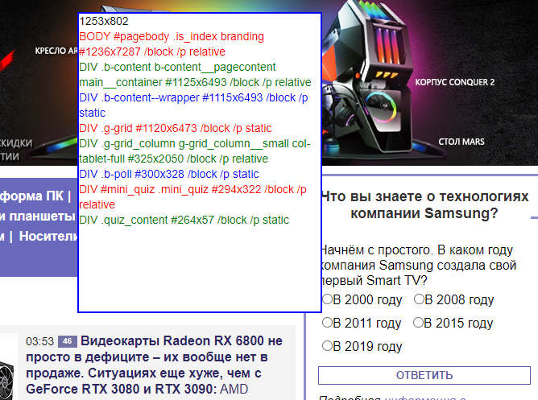

# domwalker
small snippet to browse DOM structure interactively

To use this snippet simply paste it to the browser console and run. Then you can walk with mouse cursor over web page and see web page structure, like this:  

